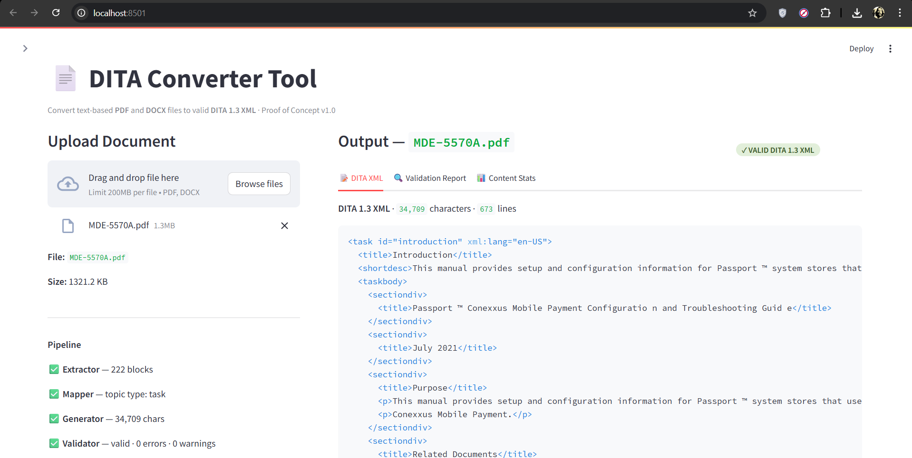
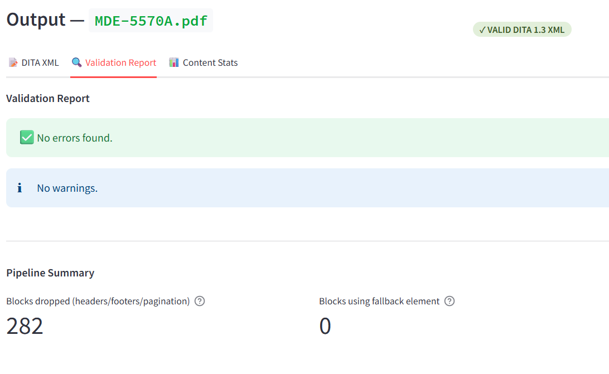
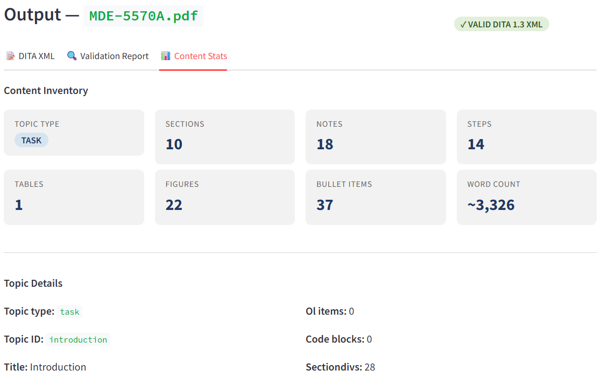
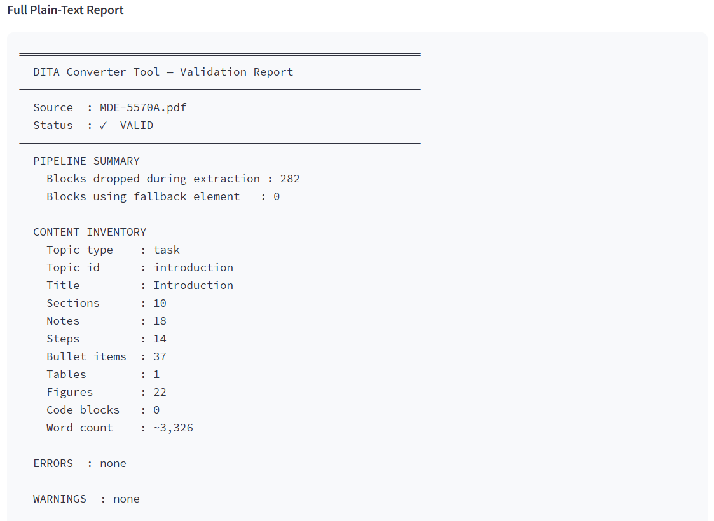
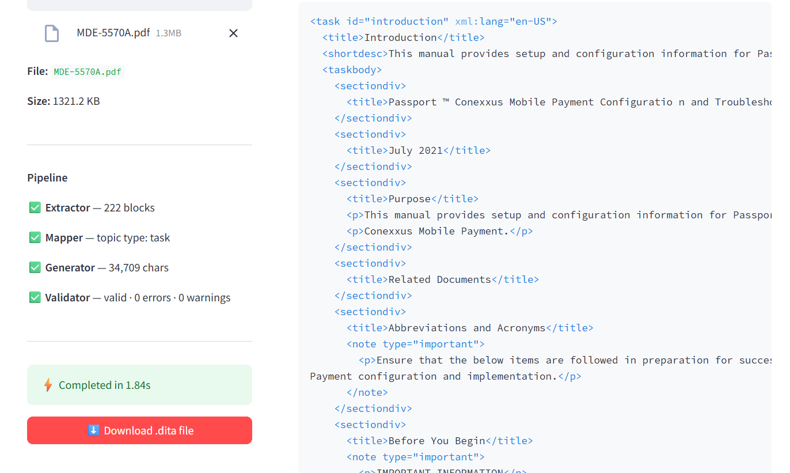

# DITA Converter Tool — Screenshots

A walkthrough of the tool converting a Gilbarco Passport technical manual (PDF) to valid DITA 1.3 XML.

---

## 1. Upload
Upload a text-based PDF or DOCX file to begin conversion.

---

## 2. Pipeline
The four-stage pipeline runs automatically — Extractor → Mapper → Generator → Validator.

---

## 3. Content Stats
A full content inventory: sections, notes, steps, figures, tables, and word count.

---

## 4. Validation Report
Errors, warnings, and a plain-text pipeline summary report.

---

## 5. DITA XML Output
Syntax-highlighted DITA 1.3 XML preview with a one-click download button.

---

[← Back to README](README.md)
